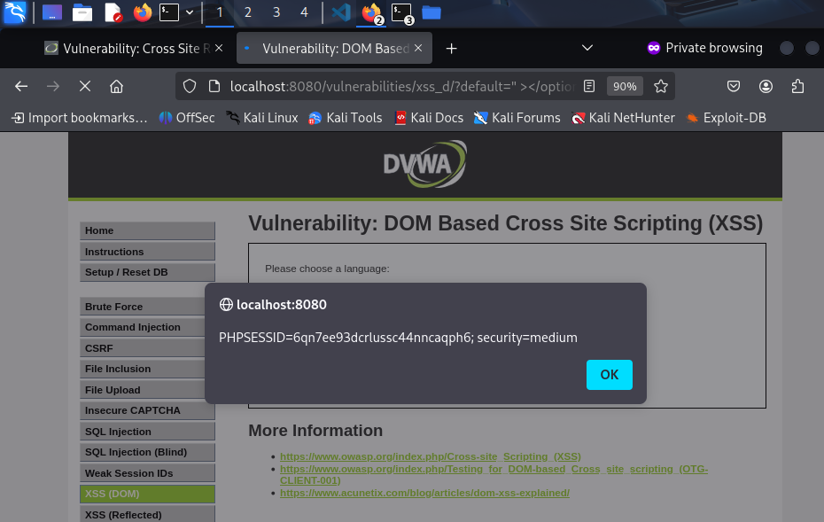

### 10. Cross Site Scripting (XSS) - DOM

- **Objetivo:** Explotar una vulnerabilidad XSS donde el ataque se ejecuta directamente en el navegador debido a la manipulación del DOM (Document Object Model) por parte del código JavaScript del lado del cliente.

- **Procedimiento:**
    1. **Identificar el Vector:** La aplicación tiene un selector de idioma que modifica el contenido de la página sin recargarla. Al inspeccionar el código, vemos que el parámetro `default` en la URL se escribe directamente en el DOM.
    2. **Inyección del Payload:** Modificamos el parámetro `default` en la URL para que contenga nuestro script.
        ```
        http://localhost:8080/vulnerabilities/xss_d/?default=<script>alert('XSS DOM')</script>
        ```

- **Resultado:**
    Al cargar la página, el JavaScript del lado del cliente escribe nuestro payload directamente en el DOM, ejecutando la alerta. El servidor nunca recibe el payload en una petición, solo el navegador lo interpreta.
    
    ## Resultado
    
