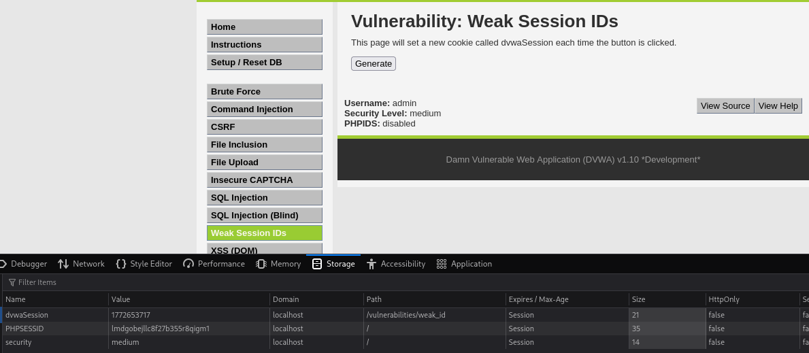

### 13. Weak Session IDs

- **Objetivo:** Demostrar cómo una mala generación de identificadores de sesión puede permitir a un atacante predecir o adivinar sesiones activas de otros usuarios.

- **Procedimiento:**
    1. **Análisis de la Generación:** La página genera una cookie llamada `dwaSession` cada vez que hacemos clic en el botón "Generate". Observamos los valores generados.
    2. **Identificación del Patrón:** Al generar varias sesiones consecutivas, observamos que los valores de `dwaSession` son números que se incrementan de forma predecible (1772653717, 1772653718, 1772653719...).
    3. **Inspección con Herramientas de Desarrollo:** Usamos las herramientas de desarrollo del navegador (pestaña "Application" o "Storage") para ver las cookies generadas y confirmar el patrón.

- **Resultado:**
    Comprobamos que los IDs de sesión son secuenciales y predecibles. Un atacante podría generar un ID válido y secuestrar la sesión de otro usuario simplemente probando números cercanos.
    
    ## Resultado
    
