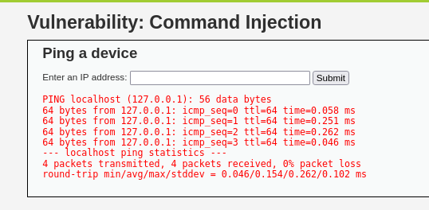

### 2. Command Injection

- **Objetivo:** Explotar la falta de validación en un campo de entrada para ejecutar comandos arbitrarios en el sistema operativo del servidor.

- **Procedimiento:**
    1. **Identificar el Vector:** La aplicación tiene un campo "Enter an IP address" que ejecuta el comando `ping` del sistema.
    2. **Inyección de Comandos:** En sistemas Linux/Unix, podemos usar caracteres como `;`, `&&` o `|` para encadenar más de un comando. Introducimos una IP seguida de un punto y coma y el comando que queremos ejecutar.
        ```
        127.0.0.1; whoami
        ```

- **Resultado:**
    La aplicación no solo ejecuta el `ping` a localhost, sino que también ejecuta el comando `whoami`, revelando el usuario bajo el cual se ejecuta el servidor web.
    
   
