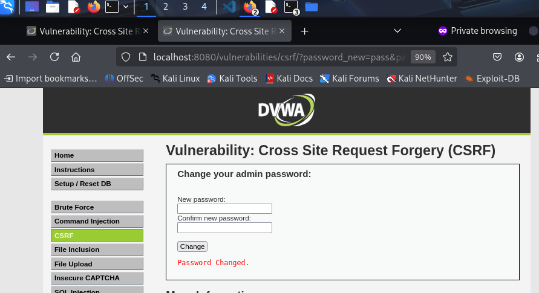

### 3. Cross Site Request Forgery (CSRF)

- **Objetivo:** Demostrar cómo un atacante puede engañar a un usuario autenticado para que ejecute acciones no deseadas (como cambiar su contraseña) sin su conocimiento.

- **Procedimiento:**
    1. **Análisis de la Petición:** Interceptamos la petición al cambiar la contraseña con una herramienta como Burp Suite. Observamos que la petición es un simple `GET` y no incluye ningún token de seguridad ni requiere confirmación de la contraseña actual.
        ```
        GET /vulnerabilities/csrf/?password_new=12345&password_conf=12345&Change=Change
        ```
    2. **Creación del Script (Página Maliciosa):** Creamos un archivo HTML que, al ser visitado por la víctima, envía automáticamente la petición para cambiar su contraseña mediante una etiqueta `img` oculta.
    3. **Ejecución:** Si un administrador con una sesión activa en DVWA visita nuestra página maliciosa, su contraseña se cambiará a "hacked" sin que se dé cuenta.

- **Resultado:**
    Tras acceder a la página maliciosa, al volver a la sección de CSRF, vemos el mensaje de confirmación "Password Changed.", indicando que el ataque fue exitoso.
    
    ## Resultado
    
