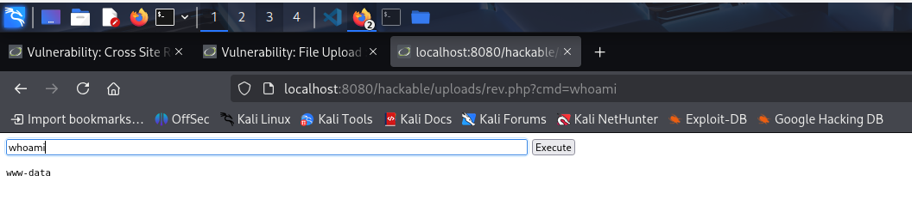

### 5. File Upload

- **Objetivo:** Subir un archivo malicioso (como una web shell) al servidor para ejecutar comandos de forma remota.

- **Procedimiento:**
    1. **Creación del Script (Web Shell):** Creamos un archivo PHP simple que ejecute comandos del sistema a través >
    2. **Bypass de Validación (Nivel Medium):** En nivel medio, DVWA valida que el archivo sea una imagen comproband>
        - `Content-Type: application/x-php` → `Content-Type: image/png`
        - Añadimos la cabecera mágica `GIF89a;` al inicio del contenido para engañar la validación por firma de arch>
    3. **Subida del Archivo:** Enviamos la petición modificada y el archivo se sube exitosamente.
    4. **Ejecución:** Accedemos a la ruta donde se ha subido nuestro archivo y ejecutamos comandos.
        ```
        http://localhost:8080/hackable/uploads/rev.php?cmd=whoami
        ```

- **Resultado:**
    A pesar de las validaciones de nivel medio, logramos subir nuestra web shell modificando la petición y ejecutamo>
    
    ## Resultado
    

