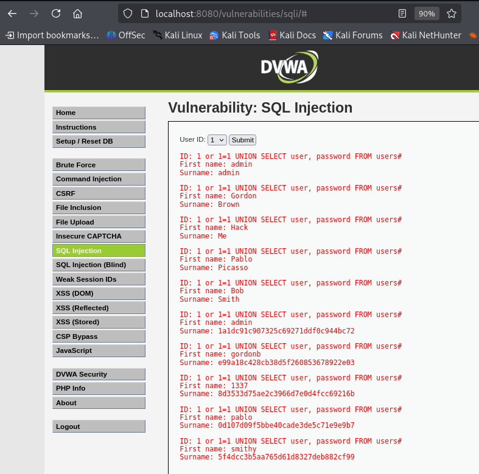

### 6. SQL Injection

- **Objetivo:** Extraer información sensible de la base de datos (como nombres de usuario y contraseñas) explotando una vulnerabilidad de inyección SQL.

- **Procedimiento:**
    1. **Identificar el Vector:** La aplicación pide un "User ID". Al introducir `1`, vemos sus datos. Sospechamos que es vulnerable.
    2. **Prueba de Inyección:** Introducimos una comilla simple (`'`) para generar un error de SQL, confirmando la vulnerabilidad.
    3. **Ataque de Inyección:** Usamos una consulta `UNION` para obtener datos de otra tabla. Usamos `or 1=1` para que la primera condición siempre sea verdadera.
        ```
        1 or 1=1 UNION SELECT user, password FROM users#
        ```

- **Resultado:**
    La aplicación muestra los nombres de usuario y sus hashes de contraseña (MD5) de la tabla `users` de la base de datos.
    
    ## Resultado
    
