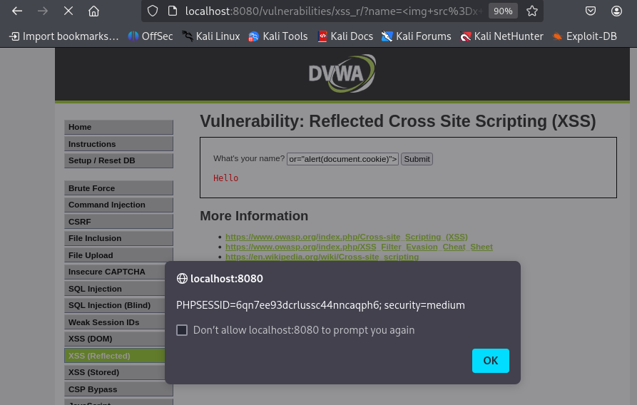

### 8. Cross Site Scripting (XSS) - Reflected

- **Objetivo:** Inyectar código JavaScript malicioso en una aplicación web que se "refleja" inmediatamente en la respuesta del servidor.

- **Procedimiento:**
    1. **Identificar el Vector:** Buscamos un campo de entrada (como un cuadro de búsqueda) cuyo contenido aparezca en la página de resultados.
    2. **Inyección del Payload:** Introducimos un script simple en el campo de entrada.
        ```html
        <script>alert('XSS Reflejado')</script>
        ```

- **Resultado:**
    Al enviar el formulario, la página recarga e incluye nuestro script, ejecutándolo y mostrando una ventana de alerta.
    
    ## Resultado
    
